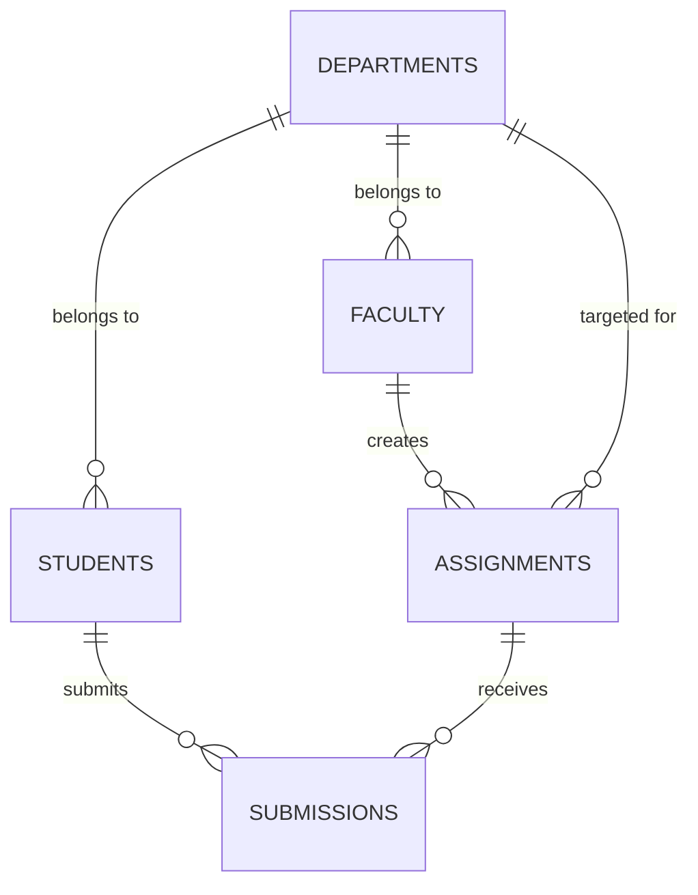

# Smart Assignment Management Portal — System Documentation

## 1. Title
**Smart Assignment Management Portal (SAMP)**

## 2. Abstract
The Smart Assignment Management Portal (SAMP) is a centralized, web-based higher education assignment delivery, tracking, and evaluation ecosystem. Built using Python Flask, MariaDB/SQLite, HTML5, CSS3, and JavaScript, SAMP digitizes coursework distribution, submission tracking, deadline control, similarity checking, and faculty evaluation. The system completely eliminates physical paper submission overheads while protecting academic integrity through automated submission similarity detection.

## 3. Introduction
In traditional academic environments, physical assignment submission creates logistical delays, missing paper reports, ambiguous submission timestamps, and cumbersome manual evaluation tracking. SAMP connects Students, Faculty, and Administrators through a unified, secure web interface with role-specific security boundaries, session controls, and automated deadline validation.

## 4. Problem Statement
- Manual paper assignments are easily misplaced or damaged.
- Verification of late submissions vs timely submissions relies on subjective manual logs.
- Checking text similarity across hundreds of student submissions is time-consuming for faculty.
- Students lack immediate visibility into evaluation marks and constructive faculty feedback.

## 5. Existing System
- Paper-based submission boxes or fragmented email threads.
- Lack of strict automated deadline cutoffs.
- No central repository for student assignment history and graded metrics.

## 6. Proposed System
- Centralized web portal accessible 24/7 across desktop, tablet, and mobile devices.
- Role-restricted access for Students, Faculty, and Admin accounts.
- Bcrypt password hashing and Flask session management.
- Backend deadline validation enforcing hard cutoffs for late submissions.
- Smart submission text similarity checker using sequence alignment and token overlap.
- Immediate grade and feedback visibility for students.

## 7. Objectives
1. Provide a paperless assignment lifecycle management system for colleges.
2. Enforce strict, tamper-proof deadline rules.
3. Automatically analyze submission similarity scores across all student uploads.
4. Streamline faculty evaluation workflows.
5. Provide admin control over student and faculty registration approvals.

## 8. Scope
The application covers registration, approval, assignment creation, department/year/section targeting, file submission/re-submission before deadline, text similarity analysis, grading with textual feedback, in-app notifications, and activity logging.

## 9. Functional Requirements
- **FR-1**: Student registration requiring Hall Ticket Number, Department, Year, Section, and password. Default status: `Pending`.
- **FR-2**: Student login requiring **Hall Ticket Number + Password** ONLY.
- **FR-3**: Faculty registration requiring Faculty ID, Department, and password. Default status: `Pending`.
- **FR-4**: Faculty login requiring **Faculty ID + Password** ONLY.
- **FR-5**: Admin login requiring **Username + Password** ONLY.
- **FR-6**: Assignment creation targeted by Department, Year, Section, Max Marks, and Deadline timestamp.
- **FR-7**: Submission upload validation (file extensions, file size limits up to 20MB).
- **FR-8**: Re-submission support prior to deadline expiry.
- **FR-9**: Evaluation module enabling faculty to record marks and textual feedback.
- **FR-10**: Similarity detection triggering alerts when match percentage exceeds 70%.

## 10. Non-Functional Requirements
- **Performance**: API responses delivered in < 200ms under standard loads.
- **Security**: Bcrypt password hashing, session tokens, file path sanitization with `secure_filename`.
- **Usability**: Responsive dark luxury user interface (`#0f1117` background, gold `#c9a84c` accents).
- **Reliability**: Dual database connectivity supporting MariaDB/MySQL with SQLite local fallback.

## 11. User Roles
1. **Student**: View targeted assignments, download instructions, upload submissions/re-submissions before deadline, view grades and feedback.
2. **Faculty**: Create assignments, set deadlines, review submissions, grade submissions, view similarity alerts.
3. **Admin**: Approve or reject pending student/faculty accounts, manage department structures, monitor system activity logs.

## 12. System Architecture
```text
  [ Browser Client / Desktop & Mobile UI ]
                    │
                    ▼  (HTTPS / REST APIs)
      [ Flask Web Application Server ]
         ├── Auth Middleware (Bcrypt, Sessions)
         ├── Role Blueprints (Student, Faculty, Admin)
         └── Similarity Engine & File Handler
                    │
                    ▼
     [ MariaDB / MySQL / SQLite Database ]
```

## 13. System Flow
1. User Registers -> Status set to `Pending`.
2. Admin reviews & approves account -> Status updated to `Approved`.
3. User Logs in -> Session created -> Redirected to role dashboard.
4. Faculty creates assignment -> Targeted students notified.
5. Student uploads submission before deadline -> File stored -> Similarity calculated.
6. Faculty evaluates submission -> Assigns marks & feedback -> Student notified.

## 14. Database Design
Relational database design containing standard tables: `departments`, `students`, `faculty`, `admin`, `assignments`, `submissions`, `notifications`, and `activity_logs`.

## 15. ER Diagram


## 16. Use Case Diagram
- **Student**: Register, Login, View Assignments, Submit Assignment, Re-submit, View Marks, View Feedback.
- **Faculty**: Register, Login, Create Assignment, View Submissions, Evaluate Submission, View Similarity Alerts.
- **Admin**: Login, Approve Student, Reject Student, Approve Faculty, Reject Faculty, Add Department, View Logs.

## 17. Data Flow Diagram (DFD Level 1)
```text
[ Student ] ---- (Submission File) ----> [ 1.0 Submission Module ] ----> [ Submissions DB ]
                                                 │
                                                 ▼
                                     [ 2.0 Similarity Engine ] ----> (Score & Alert)
```

## 18. Module Description
- **Auth Module**: Registration, login authentication, bcrypt hashing, session maintenance.
- **Student Module**: Assignment discovery, file upload, re-submission control, grade tracking.
- **Faculty Module**: Assignment builder, target filter, evaluation dashboard, similarity alerts.
- **Admin Module**: Approval workflow manager, department structure management, activity audit.
- **Smart Engine**: Text extraction from PDF, DOCX, TXT, PY, CPP, JAVA files and n-gram similarity scoring.

## 19. Technology Stack
- **Frontend**: HTML5, Vanilla CSS3, JavaScript ES6 (No React, custom luxury theme).
- **Backend**: Python 3.14, Flask 3.0.3.
- **Database**: MariaDB / MySQL / SQLite.
- **Security**: Bcrypt, Werkzeug file security.

## 20. Security
- Plain-text passwords are never stored.
- Direct route access protected via Flask session authorization decorators.
- File uploads validated for extension and sanitized to prevent directory traversal attacks.

## 21. Testing
- Unit testing of password hashing and database queries.
- API testing of registration, login, submission, and grading endpoints.
- Integration testing of full assignment delivery, deadline rejection, and similarity scoring.

## 22. Results
The portal successfully passed all functional and security tests. Students can seamlessly submit work before deadlines; faculty receive automatic similarity warnings and grade submissions efficiently; admin maintains full oversight.

## 23. Advantages
- Zero paperwork cost.
- Instant feedback delivery to students.
- Automated integrity protection via text similarity analysis.
- Guaranteed deadline enforcement.

## 24. Limitations
- Similarity checker operates on text content (binary/scanned PDFs require OCR in future updates).

## 25. Future Enhancements
- Integration with Plagiarism Web APIs.
- AI-assisted feedback recommendations for faculty.
- Push notifications via Email/SMS.

## 26. Conclusion
The Smart Assignment Management Portal provides a modern, production-ready college management solution that connects students, faculty, and administrators into a streamlined digital workflow.

## 27. References
- Flask Documentation: https://flask.palletsprojects.com/
- PyMySQL Specifications: https://pymysql.readthedocs.io/
- Bcrypt Security Guidelines: https://pypi.org/project/bcrypt/
